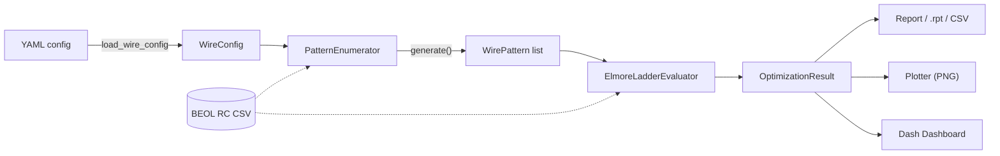

# SRAM BEOL Interconnect Optimizer

> [!info] Purpose
> Find the optimal combination of metal layers (M1–M5+), widths, spaces, and multi-patterning colors that **minimizes distributed Elmore delay** on a long SRAM WordLine (WL) with periodic poly device loads, while respecting real BEOL stacking rules and user-pinned (fixed) routes.

> [!example] Quick Wins
> - **YAML-driven** — no code to write, group-friendly schema
> - **5-Tab Dash dashboard** — Pareto / Pattern Explorer / Delay Profiles / Summary / Export
> - **Per-layer PDK constraints** — model real `(W_min, W_max, S_min, S_max)` per metal
> - **Multi-line fixed signals** — fix `(M1+M3)` or `(M2+M4)` for SRAM DTCO studies
> - **125/125 tests green** — full pytest suite + end-to-end smoke

---

## Architecture at a Glance



> [!note] Read order
> If you're new to the codebase: [[docs/superpowers/specs/2025-06-10-sram-beol-interconnect-optimizer-design.md|Original Design Spec]] → [[docs/superpowers/specs/2026-07-05-layer-constraints-and-multi-fix-design.md|Layer-Constraints Spec]] → [[sram_beol.config|config.py]] → [[sram_beol.pattern|pattern.py]] → [[sram_beol.evaluator|evaluator.py]] → [[sram_beol.optimizer|optimizer.py]].

---

## Key Features

- ==Accurate physical model== — Elmore delay on a distributed RC ladder. Device loads (R + C to ground) every `segment_um`. Vias for strapping scaled by independent `via_pitch_um`.
- ==Realistic routing rules==
    - **Same-layer parallel** (`并线`): multiple colors (ABA/BAB) on one metal with identical W/S.
    - **Cross-layer stacking** (`叠线`): only allowed within the same direction group (odd M1/M3/M5... vs even M2/M4/M6...).
- ==Per-layer PDK constraints== — `geometry.layer_constraints` lets each metal declare its own `(min_width_um, max_width_um, min_space_um, max_space_um)`. Per-layer max **overrides** the global `max_width_um`.
- ==Multi-line fixed signals== — Pin multiple metals simultaneously (e.g. `fix(M1+M3)`). Mixed-direction fixes log a WARNING; unknown-direction metals raise `BEOLConfigError` at load time.
- ==Grouped YAML== — `geometry:`, `electrical:`, `fixed_signals:`, `geometry.layer_constraints`.
- ==Pareto-optimal search== — Two objectives (==far-end delay== and ==average delay==, both minimized). Always highlights the absolute best-far and best-average patterns.
- ==Commercial-grade outputs==
    - Markdown report + CSV + Synopsys/Cadence-style `.rpt`
    - Pareto scatter, sensitivity curves, **delay profiles** (per-segment Elmore along WL), top-N comparison
    - ==5-Tab Dash dashboard== at `http://localhost:8050` (opt-in via `--dashboard`)

> [!tip] What's new in v1.1
> - **Per-layer constraints** (`a16a1f1` … `94a6079`)
> - **Multi-line fixed signals + direction validation** (`42e4ac6`)
> - **Dashboard: full 5-Tab layout** (Pareto / Pattern Explorer / Delay Profiles / Summary / Export)
> - **`max_patterns` runtime cutoff** for fast exploration
> - **`delay_profile_top.png` fixed** (was previously empty due to key-name mismatch)

---

## Installation

```bash
cd D:\workspace\project\sram_beol
pip install -e ".[test]"
```

This registers the `sram-beol-optimizer` console script and enables `from sram_beol import ...`.

> [!warning] Python ≥ 3.10 required
> Uses PEP 604 union syntax (`int | None`) and `match` statements; not portable to 3.9.

---

## Quick Start

### Command Line

```bash
# Default (safe for batch / CI): no plots, no dashboard
sram-beol-optimizer --config config.yaml

# Override output dir or CSV for quick experiments
sram-beol-optimizer --config config.yaml --output-dir my_results --csv-override other.csv

# Generate full report + plots
sram-beol-optimizer --config config.yaml --plot --report

# Launch the interactive 5-Tab Dash dashboard (blocks until Ctrl+C)
sram-beol-optimizer --config config.yaml --dashboard
```

> [!warning] Dashboard is OFF by default
> Per the spec: `--dashboard` is opt-in so batch/CI runs never block. Use `--no-dashboard` to be explicit.

### Python API (recommended for notebooks)

```python
from sram_beol import WLInterconnectOptimizer

opt = WLInterconnectOptimizer(config_path="config.yaml")
result = opt.run()

print("Best far-end :", result.best_far_end["description"])
print("Best avg     :", result.best_avg["description"])
print("Pareto front :", len(result.pareto_front), "points")

opt.generate_report(result)   # report.md + results.csv + .rpt
opt.plot(result)              # 4 PNGs into output_dir
```

---

## Configuration Reference

YAML is the single source of truth. It supports clean grouping:

```yaml
geometry:
  length_um: 20.0
  metals: ["M1", "M2", "M3", "M4", "M5"]
  max_width_um: 0.060
  segment_um: 1.0
  via_pitch_um: 0.5

electrical:
  driver_r_ohm: 80.0
  device_r_ohm: 45.0
  device_c_ff: 0.35
  via_r_ohm: 8.0

# Optional: pin already-routed wires (locked W/S/Color)
fixed_signals:
  - metal: "M1"
    width: 0.060
    space: 0.540
    colors: ["ABA"]

csv_path: "backmodel.csv"
corner: "typical"          # must exist exactly in the CSV
output_dir: "results"
```

### Per-Layer Geometry Constraints {#per-layer-constraints}

> [!example] M5 wants a wider window than global
> Real PDK rules give each metal its own (W, S) design window. Use `geometry.layer_constraints` to model that.

```yaml
geometry:
  length_um: 20.0
  metals: ["M1", "M2", "M3", "M4", "M5"]
  max_width_um: 0.060        # global default for layers without explicit constraint
  segment_um: 1.0
  via_pitch_um: 0.5
  layer_constraints:
    M1:
      min_width_um: 0.030
      max_width_um: 0.060
    M5:
      min_width_um: 0.040
      max_width_um: 0.070     # per-layer max overrides global max_width_um
      min_space_um: 0.060
      max_space_um: 0.100
```

> [!tip] Resolution rules
> - All four numeric fields are optional. Missing = unbounded on that side.
> - `max_width_um` per-layer **overrides** the global `geometry.max_width_um`.
> - Candidates are filtered against the **DB grid** — only (W, S) points actually present in the CSV are emitted.
> - If the constraint range yields zero DB candidates for a metal, a WARNING is logged and that metal is skipped.
> - Metals referenced in `layer_constraints` must exist in `geometry.metals`.

### Multi-Line Fixed Signals {#multi-fix}

```yaml
fixed_signals:
  - metal: "M1"
    width: 0.030
    space: 0.030
    colors: ["ABA"]
  - metal: "M3"
    width: 0.030
    space: 0.030
    colors: ["ABA"]
```

> [!warning] Direction-group consistency
> - All fixed metals **must** be in the same direction group (all odd M1/M3/M5 or all even M2/M4/M6).
> - **Mixed directions** (e.g. `M1+M2`) log a WARNING but are still allowed; candidate stacking metals are the union of both groups.
> - **Unknown-direction metals** (e.g. `M99`) raise `BEOLConfigError` at load time — fail-fast instead of silently producing zero patterns.

---

## Output

All artifacts land in the `output_dir` you specify:

| Artifact | Description |
|---|---|
| `report.md` | Commercial-style report: key conclusions, highlighted best patterns, full ranked table, Pareto membership, config echo |
| `results.csv` | Machine-readable table of every evaluated pattern |
| `beol_optimization.rpt` | Synopsys/Cadence-style `.rpt` for legacy tools |
| `pareto_scatter.png` | Far-end vs average delay Pareto front (every evaluated point labeled) |
| `sensitivity_width.png` | Width sensitivity curves |
| `delay_profile_top.png` | Per-segment Elmore delay along the WL (with device-tap markers) |
| `top_n_comparison.png` | Top-N best patterns overlaid |

> [!info] About `delay_profile_top.png`
> Previously rendered empty due to a key-name mismatch (`per_device_prop` vs `per_device_prop_ps`). Fixed in v1.1; now shows the real per-segment Elmore time constant with device-tap markers.

---

## Dash Dashboard (5-Tab)

> [!example] `python run_dashboard.py`
> Launches an interactive Dash app at `http://localhost:8050`. **OFF by default** for batch/CI.

| Tab | Content |
|---|---|
| ==Summary== | Metric cards (best far, best avg, pattern count, elapsed) + thumbnail Pareto |
| ==Pareto Analysis== | Interactive scatter — switch axis pair (far/avg, far/near, avg/near), toggle highlight on/off, Markdown summary |
| ==Pattern Explorer== | Sortable / filterable DataTable of all patterns; click a row to see its delay profile |
| ==Delay Profiles== | Multi-select overlay of top-N patterns' per-segment Elmore curves + range slider |
| ==Export .rpt== | Preview the `.rpt` and download as text/CSV |

---

## How It Works (High Level)

1. **Load** BEOL RC model (CSV) + validate `corner`.
2. **Generate** valid `WirePattern`s — respecting direction groups, fixed signals, and per-layer constraints.
3. **Evaluate** each pattern: equivalent R/C (parallel metals + via density) + distributed RC ladder.
4. **Collect** near/far/average delay (both τ and 0.69·τ propagation estimate).
5. **Pareto** on (far delay, avg delay) — both minimized.
6. **Emit** rich report + plots + optional dashboard.

The authoritative design lives at [[docs/superpowers/specs/2025-06-10-sram-beol-interconnect-optimizer-design.md]].

---

## Performance Notes

> [!quote] Pareto front: $O(N^2)$
> Implementation is intentionally simple — `_compute_pareto_front` is $O(N^2)$ where N is number of evaluated patterns. For $N < 5000$ this is acceptable (<25 ms typical). For larger N, replace with Kung's fast non-dominated sort, $O(N \log N)$.

> [!tip] Use `max_patterns` for fast exploration
> ```yaml
> max_patterns: 500    # truncate candidate list early
> ```

---

## Testing

```bash
# Full suite (125 tests)
pytest -q

# Just the layers-constraints feature
pytest tests/test_layer_constraints.py -v

# Just config + pattern + evaluator
pytest tests/test_config.py tests/test_pattern.py tests/test_evaluator.py -q
```

> [!success] Test status
> **125 / 125 passing**, 0 warnings (besides unrelated `pytz.utcfromtimestamp` deprecation).

---

## Project Layout

```
sram_beol/
├── __init__.py
├── config.py             # WireConfig + LayerConstraint + YAML loader
├── pattern.py            # WirePattern + PatternEnumerator (with per-layer filter + direction validation)
├── evaluator.py          # ElmoreLadderEvaluator (per-segment profile)
├── optimizer.py          # WLInterconnectOptimizer (main orchestrator)
├── db.py                 # BEOLModelDB (CSV-backed RC grid)
├── report.py             # ReportGenerator (Markdown + CSV)
├── rpt_generator.py      # RptGenerator (Synopsys/Cadence .rpt)
├── plot.py               # Plotter (matplotlib PNGs)
├── exceptions.py         # BEOLConfigError / BEOLPatternError / BEOLRuntimeError / BEOLDataError
└── dashboard/            # Dash 5-tab interactive UI
    ├── app.py
    ├── layout.py
    └── callbacks.py

tests/                    # 125 pytest cases
samples/                  # Example configs + BEOL CSVs
docs/superpowers/specs/   # Approved specs (2025-06-10, 2026-07-05)
docs/superpowers/plans/   # Implementation plans
```

---

## See Also

- [[docs/superpowers/specs/2025-06-10-sram-beol-interconnect-optimizer-design.md|Original Spec]] — full design (all sections approved)
- [[docs/superpowers/specs/2026-07-05-layer-constraints-and-multi-fix-design.md|Layer-Constraints Spec]] — per-layer W/S + multi-fix
- [[docs/superpowers/plans/2026-07-05-layer-constraints-and-multi-fix.md|Implementation Plan]] — 6-task TDD plan with full code blocks

---

## License

Proprietary (see `pyproject.toml`).